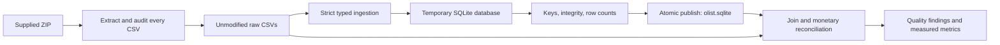
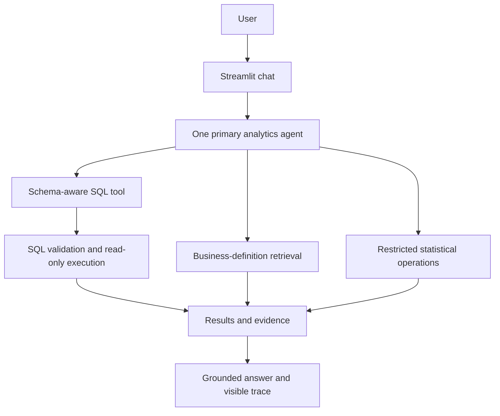

# Agentic E-Commerce Analytics Copilot

A placement-focused project for answering e-commerce business questions with inspectable, data-grounded analysis.

**Current status: Phase 1 complete — dataset audit and relational database.** The LLM, RAG, Python analytics tool, Streamlit UI and 50-question benchmark are not built yet. This repository deliberately establishes reliable data foundations first.

## Problem and business motivation

Business analysts need trustworthy answers about sales, cancellations, sellers, delivery performance and reviews. A useful analytics assistant must query actual data, explain metric definitions and expose evidence. A fluent answer over incorrectly joined data is still wrong.

## Dataset and measured results

The supplied Olist archive contains **9 CSVs and 1,550,922 records**, including 99,441 orders, 112,650 items and 1,000,163 geolocation rows. Purchase timestamps span September 2016 to October 2018. No schema was inferred from online documentation.

- **20/20 database verification checks passed**, including six joins/cardinality checks and three exact monetary reconciliations.
- **13/13 automated tests passed**, using small fixtures independent of the supplied dataset.
- All nine source row counts are preserved; there are zero enforced foreign-key violations.
- No LLM accuracy, RAG performance, experimental improvements or business-impact claims have been measured.

Read the [CSV audit](docs/generated/dataset_audit.md), [data model](docs/data_model.md), [quality interpretation](docs/data_quality.md), [verification evidence](docs/generated/verification_report.md), and [automatically generated project metrics](docs/project_metrics.md).

## Local setup and reproduction

Requires Python **3.11+** (verified here with Python 3.12.2). Phase 1 has no third-party dependencies, API key, network request or database service requirement.

Place the supplied ZIP in the repository root, then run:

```powershell
python scripts/inspect_dataset.py
python scripts/load_database.py
python scripts/verify_database.py
python -m unittest discover -s tests -v
```

If there is more than one archive, select it explicitly:

```powershell
python scripts/inspect_dataset.py --archive "archive (1).zip"
```

The audit extracts byte-identical CSVs into `data/raw/` and writes Markdown/JSON reports under `docs/generated/`. The loader creates `data/processed/olist.sqlite`. Re-running extraction restores supplied CSV bytes; re-running ingestion **replaces the selected generated database** after validation, without appending records. Close any database viewer before rebuilding on Windows. Failed ingestion leaves the previous database intact.

Scripts also accept `--raw-dir`, `--database`, and report-location options where relevant; run `--help` for details. Synthetic unit tests do not need the ZIP. Verification against the full supplied data does.

The archive, raw data, generated database and `.env` are gitignored. Generated audit reports and checksums are versioned. Redistribution of the original dataset is outside this repository's code deliverables.

## Architecture and workflow

Implemented:



The [data-model document](docs/data_model.md) includes an ER diagram, source-to-table mapping, PK/FK definitions and the migration plan. Storage uses integer cents for currency, text IDs/ZIP prefixes, validated timestamp strings, and indexed join/filter columns. Missing values stay NULL.

Planned subsequent architecture:



## Data-quality lessons

- Geolocation contains 261,831 duplicate excess records; ZIP prefix is not a unique dimension key.
- Review IDs repeat, and 547 orders have multiple reviews. Reviews use a verified composite key.
- 610 products lack categories; two additional categories have no English translation.
- 775 orders lack items, one lacks payments, and 768 lack reviews. Inner joins change the population.
- Temporal anomalies are recorded, not silently repaired.
- Directly joining payments to items inflates the payment sum from 1,600,887,212 to 2,030,813,471 cents. Aggregate to a shared grain before combining child tables. These are all-status reconciliation totals, **not defined revenue metrics**.

## Safety and testing

The loader checks exact headers, field types, non-null keys, composite-key uniqueness, six FK relationships, basic domain constraints and source checksums. Its SQL identifiers come from fixed code, and inserted values use parameters. It does not execute user-provided SQL.

`connect_readonly()` opens an existing SQLite database in read-only/query-only mode. This is a connection primitive, **not the future LLM SQL safety validator**. AST validation, analytical function restrictions, query budgets and bounded SQL repair belong to Phase 3.

Tests cover extraction traversal protection, CSV record counting including multiline text, precision-safe conversion, row preservation, repeatable rebuilds, FK/PK failures, schema drift, score validation, read-only writes and atomic recovery after failed ingestion.

## Evaluation, experiments and screenshots

Phase 1 evidence is in [generated verification reports](docs/generated/verification_report.md). The requested approximately 50-question benchmark and controlled comparisons (schema awareness, validation/retry, business-definition retrieval) will be implemented in Phase 7. There are no experimental results to report yet. UI screenshots will be added after the Streamlit phase exists.

## Planned example questions

- Which categories lead sales under an explicitly defined revenue measure?
- Which states have the highest cancellation rates?
- Are late deliveries associated with lower review scores?
- Which sellers combine high sales with poor delivery performance?

These are target capabilities, not currently supported chat commands. Phase 2 will first establish business definitions and manually verified reference SQL.

## Project structure

```text
app/database/       Schema, ingestion, read-only connection, verification
data/raw/           Extracted supplied CSVs (ignored)
data/processed/     Rebuildable SQLite database (ignored)
scripts/            Audit, load and verify command-line entry points
tests/              Offline synthetic audit and database tests
docs/generated/     Reproducible audit, loading and verification reports
docs/data_model.md  Grain, ER model, key choices and PostgreSQL migration
docs/data_quality.md
docs/interview_notes.md
docs/project_metrics.md
```

## Limitations and next phases

SQLite is a local starting point, not a concurrent production service. The audit uses in-memory sets for exact distinct counts. Data checks cannot prove business semantics or causality. Monetary reconciliation is not a revenue definition. Geolocation outliers, incomplete time coverage and repeated reviews need question-specific eligibility rules.

Next: **Phase 2 — deterministic analytics baseline**, followed by text-to-SQL, business RAG, a single agent with tools, UI, evaluation, and final packaging. Docker and model configuration will be added when there is an application to package. Interview explanations are maintained in [interview notes](docs/interview_notes.md).
