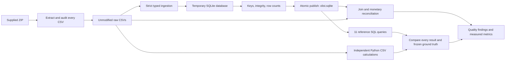
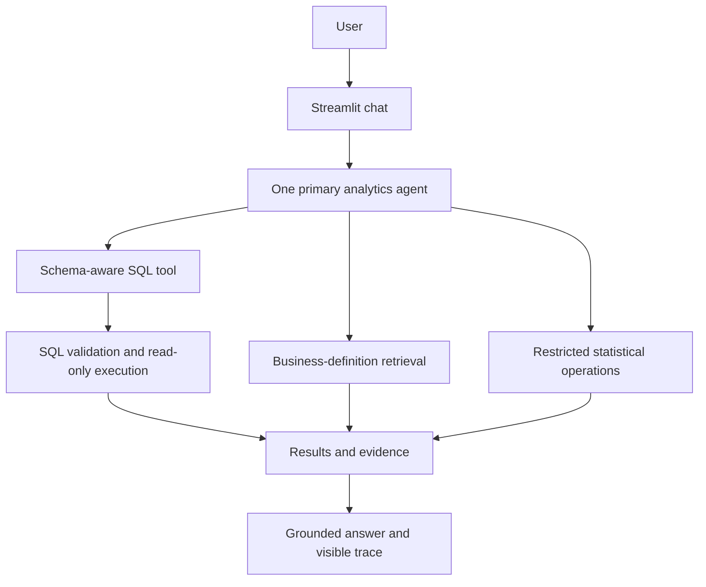

# Agentic E-Commerce Analytics Copilot

A placement-focused project for answering e-commerce business questions with inspectable, data-grounded analysis.

**Current status: Phases 1–2 complete — audited database and deterministic analytics baseline.** Eleven reference SQL queries have independently verified results and explicit metric definitions. The LLM, RAG, restricted Python analytics tool, Streamlit UI and full 50-question benchmark are not built yet.

## Problem and business motivation

Business analysts need trustworthy answers about sales, cancellations, sellers, delivery performance and reviews. A useful analytics assistant must query actual data, explain metric definitions and expose evidence. A fluent answer over incorrectly joined data is still wrong.

## Dataset and measured results

The supplied Olist archive contains **9 CSVs and 1,550,922 records**, including 99,441 orders, 112,650 items and 1,000,163 geolocation rows. Purchase timestamps span September 2016 to October 2018. No schema was inferred from online documentation.

- **20/20 database verification checks passed**, including six joins/cardinality checks and three exact monetary reconciliations.
- **11/11 reference queries match independent calculations over original CSVs**, covering 171 result rows.
- **25/25 automated tests passed**, covering ingestion, hand-calculated analytics edge cases and frozen-result regression detection with dataset-independent fixtures.
- All nine source row counts are preserved; there are zero enforced foreign-key violations.
- No LLM accuracy, RAG performance, experimental improvements or business-impact claims have been measured.

Read the [CSV audit](docs/generated/dataset_audit.md), [data model](docs/data_model.md), [quality interpretation](docs/data_quality.md), [verification evidence](docs/generated/verification_report.md), and [automatically generated project metrics](docs/project_metrics.md).

For the completed analytics baseline, start with the [walkthrough](docs/baseline_walkthrough.md), [metric contract](knowledge_base/metrics.md) and [measured query results](docs/generated/baseline_report.md).

## Local setup and reproduction

Requires Python **3.11+** (verified here with Python 3.12.2). Phases 1–2 have no third-party dependencies, API key, network request or database service requirement.

Place the supplied ZIP in the repository root, then run:

```powershell
python scripts/inspect_dataset.py
python scripts/load_database.py
python scripts/verify_database.py
python scripts/run_baseline.py
python -m unittest discover -s tests -v
```

If there is more than one archive, select it explicitly:

```powershell
python scripts/inspect_dataset.py --archive "archive (1).zip"
```

The audit extracts byte-identical CSVs into `data/raw/` and writes Markdown/JSON reports under `docs/generated/`. The loader creates `data/processed/olist.sqlite`. Re-running extraction restores supplied CSV bytes; re-running ingestion **replaces the selected generated database** after validation, without appending records. Close any database viewer before rebuilding on Windows. Failed ingestion leaves the previous database intact.

Scripts also accept `--raw-dir`, `--database`, and report-location options where relevant; run `--help` for details. Synthetic unit tests do not need the ZIP. Verification against the full supplied data does.

The baseline runner compares every result with an independent CSV calculation and the versioned snapshot in `evaluation/baseline_expected.json`. It fails on mismatches. Use `python scripts/run_baseline.py --freeze` only to intentionally refresh ground truth after reviewing a metric/data/query change; normal runs do not overwrite expected answers.

The archive, raw data, generated database and `.env` are gitignored. Generated audit reports and checksums are versioned. Redistribution of the original dataset is outside this repository's code deliverables.

## Architecture and workflow

Implemented:



The [data-model document](docs/data_model.md) includes an ER diagram, source-to-table mapping, PK/FK definitions and the migration plan. Storage uses integer cents for currency, text IDs/ZIP prefixes, validated timestamp strings, and indexed join/filter columns. Missing values stay NULL.

Planned subsequent architecture:



## Data-quality lessons

- Geolocation contains 261,831 duplicate excess records; ZIP prefix is not a unique dimension key.
- Review IDs repeat, and 547 orders have multiple reviews. Reviews use a verified composite key.
- 610 products lack categories; two additional categories have no English translation.
- 775 orders lack items, one lacks payments, and 768 lack reviews. Inner joins change the population.
- Temporal anomalies are recorded, not silently repaired.
- Directly joining payments to items inflates the payment sum from 1,600,887,212 to 2,030,813,471 cents. Aggregate to a shared grain before combining child tables. These are all-status reconciliation totals, **not defined revenue metrics**.

## Safety and testing

The loader checks exact headers, field types, non-null keys, composite-key uniqueness, six FK relationships, basic domain constraints and source checksums. Its SQL identifiers come from fixed code, and inserted values use parameters. It does not execute user-provided SQL.

`connect_readonly()` opens an existing SQLite database in read-only/query-only mode. This is a connection primitive, **not the future LLM SQL safety validator**. AST validation, analytical function restrictions, query budgets and bounded SQL repair belong to Phase 3.

Tests cover extraction traversal protection, CSV record counting including multiline text, precision-safe conversion, row preservation, repeatable rebuilds, FK/PK failures, schema drift, score validation, read-only writes and atomic recovery after failed ingestion.

Analytics tests add exact revenue/AOV arithmetic, multiple-payment fanout, latest-valid-review selection, seller/category deduplication, missing dates, strict same-day lateness, zero denominators, calendar gaps and frozen-result regression detection.

## Evaluation, experiments and screenshots

Phase 1 evidence is in [generated verification reports](docs/generated/verification_report.md). Phase 2 contributes [11 grounded reference questions/results](evaluation/baseline_expected.json), with expected tables, tools, interpretations and SQL. This is the seed for the approximately 50-question benchmark; it is not LLM evaluation. Controlled comparisons (schema awareness, validation/retry, business-definition retrieval) remain for Phase 7. UI screenshots will be added after the Streamlit phase exists.

## Reference questions available now

- Which categories lead delivered item sales, excluding freight?
- Which states have the highest cancellation rates?
- How do selected review averages differ between late and on-time deliveries?
- Which sellers combine high sales with poor delivery performance?

These are fixed reference queries run by the baseline script, not chat commands. The generated report separates observations from interpretations and exposes SQL, data and denominators. Revenue is delivered-order payment value; category/seller sales are item value, and the distinction is explicit.

## Project structure

```text
app/database/       Schema, ingestion, read-only connection, verification
app/analytics/      Fixed-query registry, SQL, independent CSV reference, reports
knowledge_base/     Versioned business definitions (not indexed for RAG yet)
evaluation/         Frozen reference questions and expected results
data/raw/           Extracted supplied CSVs (ignored)
data/processed/     Rebuildable SQLite database (ignored)
scripts/            Audit, load and verify command-line entry points
tests/              Offline synthetic audit and database tests
docs/generated/     Reproducible audit, loading and verification reports
docs/data_model.md  Grain, ER model, key choices and PostgreSQL migration
docs/data_quality.md
docs/baseline_walkthrough.md
docs/interview_notes.md
docs/project_metrics.md
```

## Limitations and next phases

SQLite is a local starting point, not a concurrent production service. The audit uses in-memory sets for exact distinct counts. Data checks cannot prove business semantics or causality. The revenue proxy is not net accounting revenue. Geography, incomplete time coverage and review selection limit interpretation. Reference timings are single local runs, not a performance comparison.

Next: **Phase 3 — schema-aware text-to-SQL with validation and bounded repair**, followed by business RAG, a single agent with tools, UI, evaluation, and final packaging. Docker and model configuration will be added when there is an application to package. Interview explanations are maintained in [interview notes](docs/interview_notes.md).
