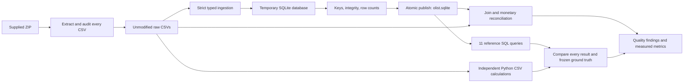
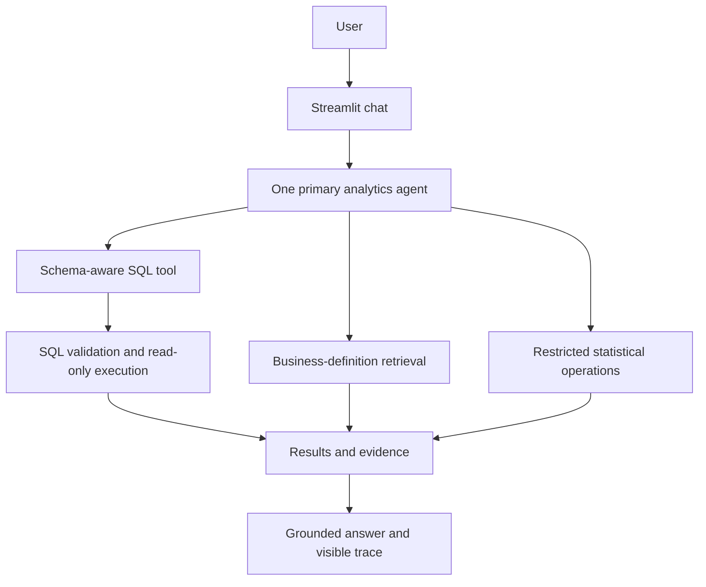

# Agentic E-Commerce Analytics Copilot

A placement-focused project for answering e-commerce business questions with inspectable, data-grounded analysis.

**Current status: Phase 4.5 correction pass complete; Phase 5 has not started.** Both live context modes now execute and exactly match all 11 unchanged development questions. All 99 offline tests pass. Calendar coverage, delivery eligibility, aggregation grain and evidence captions have shared fixes. Five of 22 answers still use literal fallbacks, and some summaries omit useful metrics. These results support continuing development, not a claim of accuracy on unseen questions. Python analytics, agent routing, Streamlit and the full benchmark remain later phases.

## Problem and business motivation

Business analysts need trustworthy answers about sales, cancellations, sellers, delivery performance and reviews. A useful analytics assistant must query actual data, explain metric definitions and expose evidence. A fluent answer over incorrectly joined data is still wrong.

## Dataset and measured results

The supplied Olist archive contains **9 CSVs and 1,550,922 records**, including 99,441 orders, 112,650 items and 1,000,163 geolocation rows. Purchase timestamps span September 2016 to October 2018. No schema was inferred from online documentation.

- **20/20 database verification checks passed**, including six joins/cardinality checks and three exact monetary reconciliations.
- **11/11 reference queries match independent calculations over original CSVs**, covering 171 result rows.
- **99/99 automated tests passed**, covering ingestion, hand-calculated analytics, frozen-result regression detection, SQL safety, bounded repair, schema retrieval, provider failures, evidence references and RAG integrity.
- All nine source row counts are preserved; there are zero enforced foreign-key violations.
- Local retrieval: 24 manually authored questions; the reserved 10 supported questions achieve Hit@3 100%, Top-1 90%, MRR@3 0.950. Two reserved unrelated questions abstain. This small retrieval benchmark does not establish LLM accuracy or business impact. See the separate live evaluation below.

Read the [CSV audit](docs/generated/dataset_audit.md), [data model](docs/data_model.md), [quality interpretation](docs/data_quality.md), [verification evidence](docs/generated/verification_report.md), and [automatically generated project metrics](docs/project_metrics.md).

For the completed analytics baseline, start with the [walkthrough](docs/baseline_walkthrough.md), [metric contract](knowledge_base/metrics.md) and [measured query results](docs/generated/baseline_report.md).

For Phase 3, read the [text-to-SQL walkthrough](docs/text_to_sql.md) and [offline integration evidence](docs/generated/text_to_sql_report.md). Reference SQL replay is explicitly distinguished from model-generated SQL accuracy.

## Local setup and reproduction

Requires Python **3.12+** (verified here with Python 3.12.2). Phases 1–2 remain standard-library-only. Phase 3 adds SQLGlot, Pydantic, python-dotenv and a replaceable OpenAI SDK adapter; offline execution needs no API key or model request. Dependency installation requires package access.

Place the supplied ZIP in the repository root, then run:

```powershell
python -m venv .venv
.venv/Scripts/python.exe -m pip install -r requirements.txt
python scripts/inspect_dataset.py
python scripts/load_database.py
python scripts/verify_database.py
python scripts/run_baseline.py
.venv/Scripts/python.exe -m unittest discover -s tests -v
.venv/Scripts/python.exe scripts/ask.py --demo count --json
.venv/Scripts/python.exe scripts/verify_text_to_sql.py
```

If there is more than one archive, select it explicitly:

```powershell
python scripts/inspect_dataset.py --archive "archive (1).zip"
```

The audit extracts byte-identical CSVs into `data/raw/` and writes Markdown/JSON reports under `docs/generated/`. The loader creates `data/processed/olist.sqlite`. Re-running extraction restores supplied CSV bytes; re-running ingestion **replaces the selected generated database** after validation, without appending records. Close any database viewer before rebuilding on Windows. Failed ingestion leaves the previous database intact.

Scripts also accept `--raw-dir`, `--database`, and report-location options where relevant; run `--help` for details. Synthetic unit tests do not need the ZIP. Verification against the full supplied data does.

The baseline runner compares every result with an independent CSV calculation and the versioned snapshot in `evaluation/baseline_expected.json`. It fails on mismatches. Use `python scripts/run_baseline.py --freeze` only to intentionally refresh ground truth after reviewing a metric/data/query change; normal runs do not overwrite expected answers.

The archive, raw data, generated database and `.env` are gitignored. Generated audit reports and checksums are versioned. Redistribution of the original dataset is outside this repository's code deliverables.

## Architecture and workflow

Implemented:



The [data-model document](docs/data_model.md) includes an ER diagram, source-to-table mapping, PK/FK definitions and the migration plan. Storage uses integer cents for currency, text IDs/ZIP prefixes, validated timestamp strings, and indexed join/filter columns. Missing values stay NULL.

Planned subsequent architecture:



## Data-quality lessons

- Geolocation contains 261,831 duplicate excess records; ZIP prefix is not a unique dimension key.
- Review IDs repeat, and 547 orders have multiple reviews. Reviews use a verified composite key.
- 610 products lack categories; two additional categories have no English translation.
- 775 orders lack items, one lacks payments, and 768 lack reviews. Inner joins change the population.
- Temporal anomalies are recorded, not silently repaired.
- Directly joining payments to items inflates the payment sum from 1,600,887,212 to 2,030,813,471 cents. Aggregate to a shared grain before combining child tables. These are all-status reconciliation totals, **not defined revenue metrics**.

## Safety and testing

The loader checks exact headers, field types, non-null keys, composite-key uniqueness, six FK relationships, basic domain constraints and source checksums. Its SQL identifiers come from fixed code, and inserted values use parameters. It does not execute user-provided SQL.

Phase 3 adds SQLGlot AST validation, physical-table and function allowlists, SQLite authorization independent of the parser, query-only/read-only connections, execution/output limits and at most three SQL attempts. `--json` exposes the selected schema, SQL, data, retries and timing. Safe execution does not imply semantically correct metrics; see the [safety limits](docs/text_to_sql.md).

Tests cover extraction traversal protection, CSV record counting including multiline text, precision-safe conversion, row preservation, repeatable rebuilds, FK/PK failures, schema drift, score validation, read-only writes and atomic recovery after failed ingestion.

Analytics tests add exact revenue/AOV arithmetic, multiple-payment fanout, latest-valid-review selection, seller/category deduplication, missing dates, strict same-day lateness, zero denominators, calendar gaps and frozen-result regression detection.

## Evaluation, experiments and screenshots

Phase 1 evidence is in [generated verification reports](docs/generated/verification_report.md). Phase 2 contributes [11 grounded reference questions/results](evaluation/baseline_expected.json), with expected tables, tools, interpretations and SQL. This is the seed for the approximately 50-question benchmark; it is not LLM evaluation. Controlled comparisons (schema awareness, validation/retry, business-definition retrieval) remain for Phase 7. UI screenshots will be added after the Streamlit phase exists.

## Reference questions available now

- Which categories lead delivered item sales, excluding freight?
- Which states have the highest cancellation rates?
- How do selected review averages differ between late and on-time deliveries?
- Which sellers combine high sales with poor delivery performance?

These fixed queries have verified baseline results. Offline Phase 3 demos replay fixed responses; they do not perform arbitrary natural-language generation. The optional `scripts/ask.py --live --question "..." --json` path requires explicit local model configuration; it has now been exercised in the live evaluation. Revenue is delivered-order payment value; category/seller sales are item value, and the distinction is explicit.

## Project structure

```text
app/database/       Schema, ingestion, read-only connection, verification
app/analytics/      Fixed-query registry, SQL, independent CSV reference, reports
app/text_to_sql/    Model adapter, schema matching, validator, executor, bounded loop
app/rag/            Local embeddings, heading chunks, exact cosine retrieval
knowledge_base/     Versioned business definitions with source citations
evaluation/         Frozen reference questions and expected results
data/raw/           Extracted supplied CSVs (ignored)
data/processed/     Rebuildable SQLite database (ignored)
scripts/            Audit, load and verify command-line entry points
tests/              Offline synthetic audit and database tests
docs/generated/     Reproducible audit, loading and verification reports
docs/data_model.md  Grain, ER model, key choices and PostgreSQL migration
docs/data_quality.md
docs/baseline_walkthrough.md
docs/text_to_sql.md
docs/interview_notes.md
docs/project_metrics.md
```

## Limitations and next phases

SQLite is a local starting point, not a concurrent production service. The audit uses in-memory sets for exact distinct counts. Data checks cannot prove business semantics or causality. The revenue proxy is not net accounting revenue. Geography, incomplete time coverage and review selection limit interpretation. Reference timings are single local runs, not a performance comparison.

Phase 4 and its focused correction pass are complete. The next planned phase is a single agent with tools, followed by UI, evaluation and packaging; **Phase 5 has not started**. Interview explanations are maintained in [interview notes](docs/interview_notes.md).

## Phase 4: local business knowledge RAG

Read the [RAG walkthrough](docs/rag.md), [retrieval results](docs/generated/rag_report.md) and [combined integration check](docs/generated/phase4_integration.md). Two Markdown documents produce 13 heading-aware chunks. The [final focused check](docs/generated/phase4_final_checks.md) includes all 71 unit tests after the last RAG integrity fix. BGE-small English embeddings run locally on CPU through FastEmbed; FAISS performs exact cosine search over 384-dimensional normalized vectors. No inference API or credentials are needed.

Run once with network access to download pinned public model weights, then build and query offline:

```powershell
.venv/Scripts/python.exe scripts/download_embedding_model.py
.venv/Scripts/python.exe scripts/build_knowledge_index.py
.venv/Scripts/python.exe scripts/ask.py --define "What does late delivery mean?" --json
.venv/Scripts/python.exe scripts/ask.py --demo cancellation --rag --json
.venv/Scripts/python.exe scripts/verify_rag.py
.venv/Scripts/python.exe scripts/check_project.py --report-name phase4_integration
```

`--define` performs real semantic lookup and returns verbatim excerpts with source lines. `--rag` supplies retrieved definitions to SQL planning and records sources in the result; `--demo` still uses fixed scripted SQL. The optional live path accepts `--rag`; its initial evaluation is reported below. With no sufficiently similar definition, the RAG path asks for clarification. Similarity cannot guarantee relevance or completeness, especially for compound questions.

Rebuild the index whenever Markdown documents change; stale indexes are rejected. Weights and indexes are ignored by Git and contain no transaction rows. The final check rebuilds the database from the original archive and tests all implemented phases together. It requires the archive, installed dependencies and downloaded weights, but makes no API calls.

## Initial live model evaluation

The [live results and failure analysis](docs/generated/live_evaluation.md) record 22 real model-generated SQL runs on 11 development questions, each with full-contract and retrieved-context prompting. Exact result accuracy was **8/11 (72.7%) for both contexts**. SQL executed in 10/11 full-contract runs and 11/11 RAG runs. This is a small, single-sample development comparison with explicit output contracts, not held-out accuracy or proof that RAG improves answers.

Of 13 structurally accepted explanations, assistant review found two with incorrect seller attribution or extrema labels. Valid references and copied numbers alone do not guarantee truthful business prose. Eight other executions used literal fallback explanations; one question exhausted SQL retries. The [review annotations](evaluation/live_answer_review.json) separate label meaning, question coverage and underlying SQL accuracy.

Read [methodology and reproduction](docs/live_evaluation.md). Live evaluation requires configured `.env` and explicit `--live`, caps API calls and preserves prior reports. Offline scripts and tests continue to use scripted models and make no API calls. The initial benchmark used 48 API calls, with an estimated cost of USD 0.063627 excluding connectivity smoke tests; this is a token-based estimate, not an invoice.


## Phase 4.5: corrected live results

The [correction report](docs/generated/phase45_report.md) preserves each original failure, its root cause, shared fix and regression test. Questions, model snapshot and reference answers were unchanged.

| Context | SQL execution before → after | Exact results before → after |
|---|---:|---:|
| Full business definitions | 10/11 → 11/11 | 8/11 → 11/11 |
| Retrieved definitions | 11/11 → 11/11 | 8/11 → 11/11 |

Four connection-local metric views establish order, order/category, order/seller and calendar-month grains. Missing payments remain NULL; delivery duration and late flags use the same eligible population. Definition retrieval includes explicit prerequisite definitions. Explanation captions and group identities are rendered from evidence, removing unsupported model-written ranking labels.

Validation passed **99 offline tests (23 new), 16 full-data metric checks and 11 guarded reference replays**. Inspection found no misleading interpretations in the 22 rendered answers. Seventeen model cell selections were accepted; five answers used safe literal fallbacks. This is constrained evidence selection, not a measurement of unrestricted narrative quality. Some summaries remain incomplete. The corrected live run used 46 API calls at an estimated USD 0.056504, not an invoice.

Reproduce local checks without API calls after setup:

```powershell
.venv/Scripts/python.exe scripts/verify_metric_views.py
.venv/Scripts/python.exe scripts/report_phase45.py
```

The report command reruns offline tests and checks the preserved live evidence and its review annotations; it does not generate a new live sample. See [implementation and trade-offs](docs/phase45_corrections.md) for full reproduction commands. This was one correction rerun on the development benchmark, not a held-out test or an isolated experiment proving which change helped.
