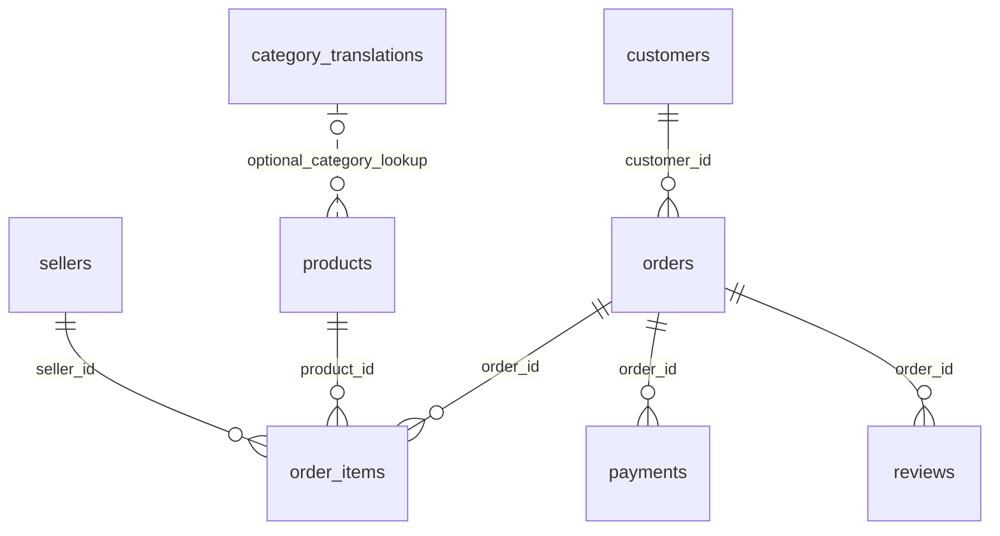

# Phase 1 data model

This model comes from the supplied `archive (1).zip`, not an online schema. See the [full CSV audit](generated/dataset_audit.md) for every column's missingness and distinct counts. [Executable DDL](../app/database/schema.sql) is the authoritative database schema.

## Source files, grains and keys

All source records are retained. File column counts refer to raw CSVs; the geolocation table adds one surrogate key. PK means primary key; FK means an enforced foreign key.

| Source CSV → database table | Rows × columns | Grain and primary key | Important columns / relationships |
|---|---:|---|---|
| `olist_customers_dataset.csv` → `customers` | 99,441 × 5 | Customer record; PK `customer_id` | `customer_unique_id` identifies repeat buyers; ZIP prefix, city, state |
| `olist_orders_dataset.csv` → `orders` | 99,441 × 8 | Order; PK `order_id` | FK `customer_id` → customers; status; purchase, approval, carrier, customer-delivery and estimated-delivery timestamps |
| `olist_order_items_dataset.csv` → `order_items` | 112,650 × 7 | Item within order; PK (`order_id`, `order_item_id`) | FKs to orders, products and sellers; price, freight, shipping deadline |
| `olist_order_payments_dataset.csv` → `payments` | 103,886 × 5 | Payment sequence within order; PK (`order_id`, `payment_sequential`) | FK to orders; payment type, installments, value |
| `olist_order_reviews_dataset.csv` → `reviews` | 99,224 × 7 | Review/order pair; PK (`review_id`, `order_id`) | FK to orders; score, optional title/message, creation and answer timestamps |
| `olist_products_dataset.csv` → `products` | 32,951 × 9 | Product; PK `product_id` | Category, name/description lengths, photo count, weight and dimensions |
| `olist_sellers_dataset.csv` → `sellers` | 3,095 × 4 | Seller; PK `seller_id` | ZIP prefix, city, state |
| `product_category_name_translation.csv` → `category_translations` | 71 × 2 | Translation; PK `product_category_name` | English category name; optional logical lookup from products, not enforced FK |
| `olist_geolocation_dataset.csv` → `geolocation` | 1,000,163 × 5 | Source coordinate record; generated PK `geolocation_row_id` | ZIP prefix, latitude, longitude, city, state; ZIP is not a key |

The item, payment and review composite keys are unique and non-null in the supplied data, confirmed by successful constrained ingestion and source-count reconciliation. `review_id` alone is not unique: 789 review IDs appear against multiple orders. There are also 547 orders with more than one review. The composite key describes observed records; it does not establish that every review is an independent opinion. A future dataset containing repeated review/order pairs would fail loading and require a reviewed schema decision.

`customer_id` happens to be unique in this orders file too. We use `order_id` as the order PK and do not enforce a one-order-per-customer restriction based on a single snapshot. `customer_unique_id` has 96,096 distinct values across 99,441 records and must be used for person-level repeat-purchase analysis.

## Relationships

The diagram expresses allowed relational cardinality, not a guarantee that every parent has children. Six enforced relationships exist: orders→customers; items→orders/products/sellers; payments→orders; reviews→orders. All have zero orphan records. The category translation lookup is deliberately optional: 610 products have no category, and 13 products across two categories have no translation. Use a LEFT JOIN and retain the original label when no English name exists; do not invent translations.

Geolocation is separate from this key-based diagram. Customers/sellers can match many coordinate rows by ZIP prefix. There are 19,015 distinct prefixes, 8,556 prefixes with multiple city labels, and eight with multiple states. There are also 278 customer records and seven seller records with no matching prefix. A direct geolocation join multiplies business rows. For state-level analysis, use customer/seller state directly. A future map should use a separately documented, one-row-per-prefix aggregation with coverage and outlier flags.

## Storage decisions and source transformations

| Source | Database representation | Reason |
|---|---|---|
| `price`, `freight_value`, `payment_value` | `price_cents`, `freight_value_cents`, `payment_value_cents`, INTEGER | Decimal parsing and exact ×100 conversion; no float rounding. Divide by 100.0 only for display in BRL. |
| `product_name_lenght`, `product_description_lenght` | Corrected suffix `length`, INTEGER | Correct source spelling in the database only; mapping is explicit. |
| Whole-number attributes such as `100.0` | INTEGER | Reject fractional input rather than truncate it. |
| Empty/whitespace-only cells | SQL NULL | Missing is not zero or an empty category. |
| Source timestamps | Validated `YYYY-MM-DD HH:MM:SS` TEXT | Lexically sortable in SQLite. No timezone is supplied or invented. |
| IDs and ZIP prefixes | TEXT, source value preserved | Identifiers are not quantities; preserve leading zeros if present. No padding is applied. |
| Latitude/longitude | REAL with global bounds | Coordinates are approximate measurements, unlike money. Geographical outliers remain flagged. |
| Geolocation key | 1-based CSV data-record ordinal | Retains all repeated source rows; stable for the exact source file, not across reordered files. |

CSV bytes are unchanged. Checksums are recorded both by the audit and ingestion scripts. All nine raw row counts match the database. Monetary totals reconcile exactly against independent `Decimal` sums over source CSVs.

## Join discipline

Choose the unit of analysis before writing SQL. An order can have several items, sellers, payments and reviews. Summing order payment values after joining those raw tables will overcount. The supplied data demonstrates the problem: all payment rows total 1,600,887,212 cents; joining payments directly to items produces 2,030,813,471 cents. Neither total is labeled revenue here because successful-order policy is a Phase 2 decision.

Aggregate children to one row per order before combining order metrics. For seller-level analysis, deduplicate order/seller pairs first; an order review is not a direct seller-specific rating. Category/seller attribution of order payments requires an explicit allocation rule. Item value and payment value are different measures, and freight must be handled explicitly.

## SQLite now; PostgreSQL later

SQLite fits a single-user local placement demo and has successfully ingested this snapshot in one file. Python's standard-library driver keeps this phase reproducible without package downloads or server credentials. Indexes cover foreign keys, purchase time, order status, category, customer identity, states and ZIP lookup columns. Existing composite PK indexes cover order joins for items and payments. No ORM is needed for these simple bulk-load operations.

For multi-user deployment, isolate access through `app/database`, add a PostgreSQL driver or SQLAlchemy Core, and replace SQLite-specific connection/PRAGMA/build mechanics. Use BIGINT for money, TIMESTAMP WITHOUT TIME ZONE until source timezone is known, and DOUBLE PRECISION for coordinates; retain IDs as text and preserve composite PK/FK semantics. Use COPY into staging tables, validate them, then transactionally publish. Rewrite any SQLite-specific date expressions in later analytics. This is a migration plan, not a claim that the current loader already supports PostgreSQL.
