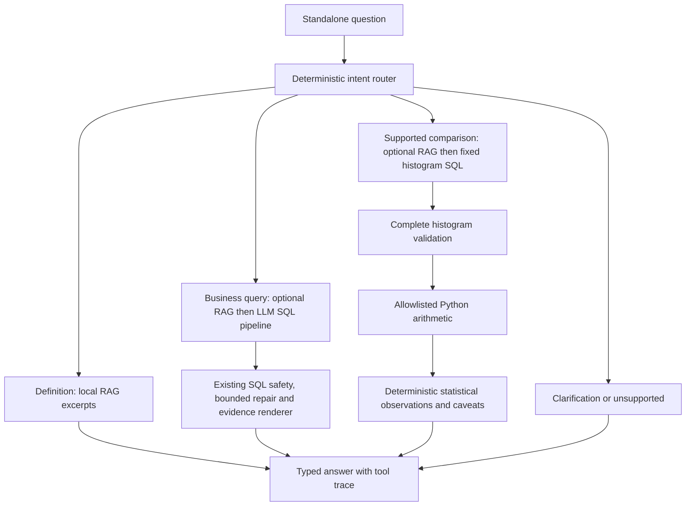

# Phase 5: one analytics agent with explicit tools

The public entry point is `app.agent.runner.run_agent`. It returns a typed `AgentResult`: answer, status, selected route, SQL/result, sources, analysis, caveats, trace, usage and elapsed time. The original text-to-SQL entry point and Phase 4.5 evidence remain available. There is no Streamlit interface yet; that is Phase 6.



## Routing contract

| Question | Tools |
|---|---|
| How many orders are there? | SQL |
| What does late delivery mean? | RAG |
| Which state generated the highest revenue? | RAG, SQL |
| Are late deliveries associated with lower ratings? | SQL, Python |
| Using business definitions, are late deliveries associated with lower ratings? | RAG, SQL, Python |

Bare “What is revenue?” or “What is the cancellation rate?” requests select definitions; use “Calculate” or a group/period for a numerical query. SQL still needs the approved metric contract even in SQL-only mode: the existing pipeline supplies full definitions when no retriever is passed. Business terms generally select retrieved context. Schema selection, read-only execution, semantic guards, at most three attempts and evidence captions are reused unchanged. The router is not the SQL security boundary.

Definition answers return cited excerpts without an LLM. Python comparisons use a fixed, inspectable input query over `metric_orders`, rather than asking the LLM to rediscover a known population. Ordinary SQL still uses the replaceable model adapter. No model-generated Python is executed; there is no `eval`, `exec`, shell, filesystem or network tool exposed to the agent. There is no hidden multi-agent loop or routing API call.

Every request is independent. Ambiguous follow-ups ask for a standalone question. Unsupported inferential, forecasting and filtered comparison requests fail explicitly. The supported statistical patterns match the whole question; extra state/date/seller filters cannot silently be ignored. This is deliberately limited language coverage, not a universal intent classifier. Regex rules can miss paraphrases or over-classify phrases; the routing development set does not measure generalization.

## Restricted Python operation and assumptions

`compare_review_histograms` consumes at most ten cells: two delivery groups times five possible scores. SQL counts every eligible reviewed order before returning rows, so the normal preview limit cannot silently sample the population. Python rejects truncation, duplicate cells, invalid scores/counts and missing groups. Payments/items never enter this query, avoiding fanout. Eligible review selection and valid delivery population are inherited from the verified order-grain view.

Python computes group counts, mean scores, late-minus-on-time difference, and lower/equal/higher cross-group pair proportions. For example, the lower proportion is `sum(late_count[s] * on_time_count[t] for s < t) / (late_total * on_time_total)`. Histograms avoid materializing hundreds of millions of order pairs. The proportions describe all cross-group pairs in this observed dataset; they do not predict an individual order or estimate a causal effect.

Review scores are ordinal: means assume equally spaced score points, while pair comparisons need only their ordering. Orders with missing eligible reviews are excluded. Customer repetition, seller effects, geography, product mix and selective reviewing prevent treating this as a causal experiment. No p-value or significance claim is produced. An inferential extension would need a justified sampling model, treatment of dependence and confounding, and separate validation.

## Run it

After the existing database and local knowledge index are built:

```powershell
# Local RAG, no API call
.venv/Scripts/python.exe scripts/ask_agent.py --question "What does late delivery mean?" --json

# Real database plus restricted Python, no API call
.venv/Scripts/python.exe scripts/ask_agent.py --question "Are late deliveries associated with lower ratings?" --json

# Explicitly scripted plumbing demonstration, not live generation
.venv/Scripts/python.exe scripts/ask_agent.py --question "How many orders are there?" --demo-count --json

# Live model SQL with retrieved definitions; uses existing .env
.venv/Scripts/python.exe scripts/ask_agent.py --live --question "Which states generated the most revenue?" --json

# Tests, real local retrieval and independent CSV validation
.venv/Scripts/python.exe scripts/verify_agent.py --output docs/generated/phase5_recheck.json
```

Add `--live` to the verification command for two live SQL smoke questions (up to eight model calls). Choose a fresh output path; verification refuses to overwrite evidence. Database/index/raw files must be present. Credentials stay in ignored `.env`. Without `--live`, arbitrary SQL generation is not silently enabled.

## Evidence and scope

See [final verification](generated/phase5_final_verification.json) for full test output, routing cases, real tool results, independent raw-CSV agreement, live responses and database hash equality. The [first attempt](generated/phase5_verification.json) preserves two network failures under sandbox restrictions; its local tests and data checks passed. The [second attempt](generated/phase5_attempt2.json) succeeded on both live questions but exposed a test-fixture ambiguity: “What is the cancellation rate?” now selects a definition. The calculation test now explicitly says “Calculate the cancellation rate”. The final run passes all 114 tests and reuses those two successful live responses, with their file hash and origin recorded; no further model calls were made. The retry used network permission, not a relaxed SQL validator.

The routing cases in `evaluation/phase5_routing.json` are manually specified development cases. Scripted model tests exercise composition and failures, not model intelligence. The new two-question live smoke checks integration, not the unchanged eleven-question Phase 4.5 benchmark or the later fifty-question evaluation. Previously reported full-benchmark scores remain historical. No new provider/framework dependency was added.

The next phase is the UI, not broader statistical autonomy. Current limitations include one Python operation, narrow statistical phrasing, no conversation memory, potential incomplete SQL explanations inherited from Phase 4.5 and no production-level guarantees. Extend the tool catalog only for a concrete analysis need with a defined input population and tests.
