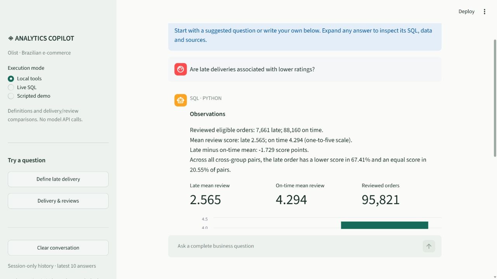
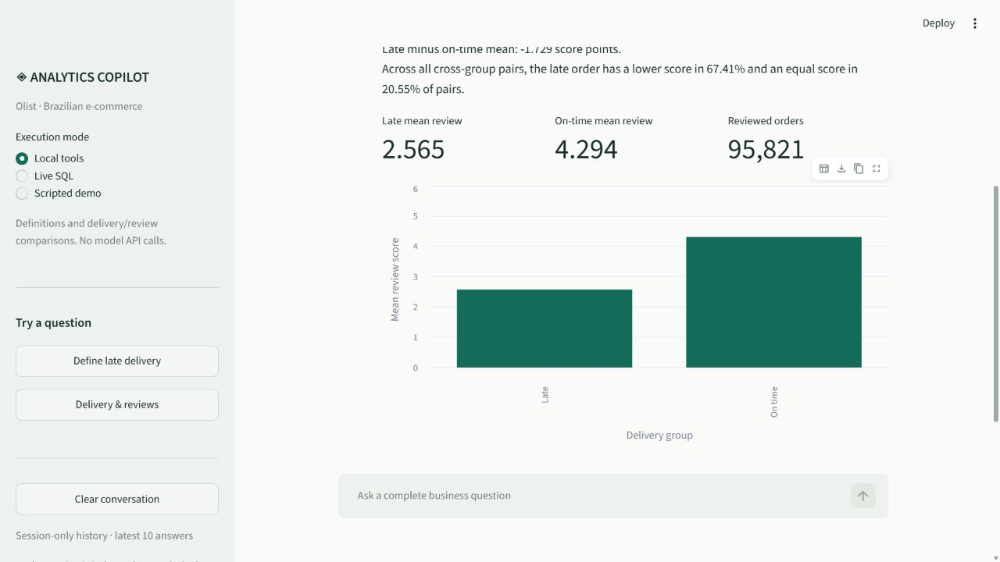
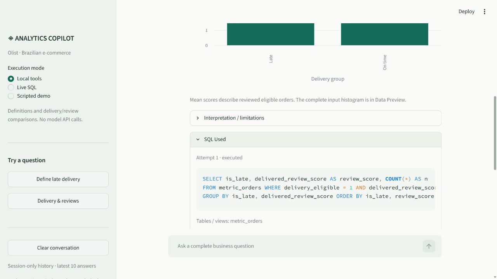

# Phase 6: conversational analytics interface

The Streamlit application is a thin view over the existing Phase 5 agent. It displays observations, charts, inspectable evidence and limitations; it does not generate its own analytical answers or change business definitions. Phase 7 evaluation has not started.

## Launch locally

From the repository root, after the existing dataset, database and knowledge-index setup:

```powershell
.venv/Scripts/python.exe -m pip install -r requirements.txt
.venv/Scripts/python.exe -m streamlit run app/main.py
```

Open `http://127.0.0.1:8501`. If the port is occupied, add `--server.port 8502` and use that port instead. The checked-in configuration binds to loopback and disables Streamlit usage telemetry. No login or public deployment is introduced.

Choose a mode in the sidebar:

- **Local tools:** cited definitions and the delivery/review comparison. No model API calls. This is the default.
- **Live SQL:** arbitrary supported SQL questions use the existing `OPENAI_API_KEY` and `OPENAI_MODEL` in local `.env`. Definitions and the supported Python comparison still do not need model calls. Credentials are never entered in the UI or displayed.
- **Scripted demo:** the exact order-count example replays a fixed SQL plan and is labeled `offline-scripted-not-an-llm`. It does not generate SQL for new questions. Local tools remain available.

The sidebar offers appropriate examples. Each submission runs once; chart selections and ordinary Streamlit rerenders display the saved response. Model clients are created per request; embeddings/retriever are cached per browser session. No global model usage object or global answer cache is shared between sessions.

The latest ten answers are stored in Streamlit session state. Clear conversation removes that displayed history. Reloading/reconnecting can reset the session. History is for reading previous answers; it is not sent back to the model. Restate the metric, population and period in each question.

## Evidence and charts

Every response includes expanders for SQL Used, Data Preview, Sources / Business Definitions, Tool Trace and Execution Information. Caveats appear separately under Interpretation / limitations. Failed, unsupported and clarification responses retain the trace and display their status. Invalid model explanations remain explicitly marked in execution information.

SQL inspection includes rejected attempts and executed statements, with their statuses. Tables/views and execution time remain available. The preview labels truncation and raw integer-cents units; NULL is never converted to zero. Source headings and line references are preserved as plain text. Unknown setup errors return a sanitized setup message instead of browser tracebacks containing arbitrary exception text.

Charts require a complete result with two to sixty unique groups, one recognized dimension and a known numeric measure. Unsupported shapes still receive their data table. Category/state results use bars; purchase-month results use lines with separate segments across missing months or NULL observations. Charts convert `_cents` to BRL for display without altering the query result. They do not aggregate groups or infer rankings. A single-row result can show up to three metric cards; truncated previews never produce cards or charts. The statistical comparison has a separate two-group mean chart and exact input histogram.

## Reproduce verification

```powershell
# Entire suite, no API calls
.venv/Scripts/python.exe -m unittest discover -s tests -v

# Real database/embedding UI flows plus all tests, no API calls
.venv/Scripts/python.exe scripts/verify_ui.py --output docs/generated/phase6_recheck.json

# Also test one live order-count request (at most four model calls)
.venv/Scripts/python.exe scripts/verify_ui.py --live --output docs/generated/phase6_live_recheck.json
```

Choose a fresh report filename to preserve evidence. [Saved verification](generated/phase6_verification.json) records **128 passing tests**, including 14 new UI/service/chart tests, and **4/4 real-data AppTest flows**. The live flow returns the reference count; definitions retrieve the expected heading; the statistical result matches frozen independently verified counts and means. Rerenders preserve each saved answer. Database bytes are unchanged. This is UI integration evidence, not an expanded SQL-accuracy benchmark or a usability study.

The running page was also inspected in a browser: startup, real statistical answer, chart, SQL expansion and input data. The following are actual screenshots, not mockups:







## Design and limitations

`app/main.py` renders widgets/history. `app/ui/service.py` creates the required resources and calls the agent. `app/ui/presentation.py` prepares charts without queries or API calls. Existing agent and SQL modules remain unchanged. New direct pins are Streamlit 1.64.0, pandas 3.0.6 and Altair 6.3.0; Streamlit manages the chart/dataframe runtime. See the official [AppTest API](https://docs.streamlit.io/develop/api-reference/app-testing/st.testing.v1.apptest) and [resource caching reference](https://docs.streamlit.io/develop/api-reference/caching-and-state/st.cache_resource).

Streamlit is appropriate for this local analyst demo, with less frontend infrastructure to explain. It is not a multi-user production service. There is no conversational coreference resolution, resumable background execution, authentication or public hosting. Session-scoped embeddings can consume additional memory across browser sessions. The Phase 5 statistical scope and Phase 4.5 explanation limitations remain. Broader question evaluation and controlled experiments belong to Phase 7; no new general-accuracy claim is made here.
