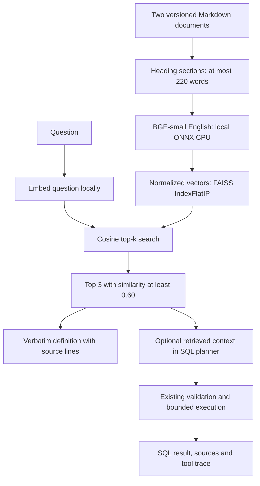

# Phase 4: business knowledge retrieval

**Historical phase walkthrough:** the later [live model evaluation](live_evaluation.md) now records actual API-backed SQL and constrained explanation results. Statements below about unmeasured live behavior describe the original phase completion.


Phase 4 adds real local semantic retrieval and an optional RAG context path into the guarded SQL planner. Definition answers are verbatim, cited excerpts. They do not need a generative model. Live SQL generation and generative answer quality remain unmeasured because development is offline by user request.



## Documents and metric continuity

`knowledge_base/metrics.md` is the Phase 2 metric contract, preserved byte-for-byte after newline normalization because its hash is part of frozen ground truth. Its introductory statement that embeddings are not yet implemented describes Phase 2, not the current application. `order_lifecycle.md` adds snapshot lifecycle, payment-grain and unavailable-data boundaries. Neither file contains fabricated transactional totals.

Revenue remains delivered-order recorded payment value, inclusive of any freight in payments. Category/seller item sales are different measures. Cancellation includes exactly `canceled`; lateness uses strict timestamp comparison and explicit eligibility. Retrieval does not redefine these metrics.

## Embeddings and search

The embedding model is `BAAI/bge-small-en-v1.5`, using the quantized ONNX assets from `Qdrant/bge-small-en-v1.5-onnx-Q`, pinned to revision `52398278842ec682c6f32300af41344b1c0b0bb2`. FastEmbed 0.8.0 runs it locally with two CPU threads. Output dimension is 384. The one-time download uses public model hosting; normal build and query paths require local assets and never fall back to network downloads. Missing assets produce an explicit setup error.

This compact English model is suitable for a small English metric glossary. It was selected for local CPU practicality, not because a comparison proved it best. Alternatives include TF-IDF/BM25 (smaller dependencies but weaker paraphrase matching), other local encoders and hosted embeddings (network/cost/privacy tradeoffs). The dataset's Portuguese categories are not translated by this model; the knowledge documents are English.

Both passage and query vectors are L2-normalized. Their inner product is cosine similarity, so exact `IndexFlatIP` search is straightforward. With 13 chunks, approximate search and a vector server add no demonstrated benefit. Scores are similarity values, not calibrated confidence probabilities. The fixed threshold 0.60 was selected before development evaluation and retained; there was no held-out tuning or threshold optimization experiment.

Sources: [model card](https://huggingface.co/BAAI/bge-small-en-v1.5), [FastEmbed documentation](https://qdrant.github.io/fastembed/), [FAISS cosine guidance](https://github.com/facebookresearch/faiss/wiki/MetricType-and-distances). The model card lists the MIT license; model weights are not committed to this repository.

## Chunking and reproducibility

Chunks respect Markdown headings and retain exact body text with one-based source line ranges. Longer sections split on complete lines with one-line overlap, up to 220 words; oversized single paragraphs must be split in the source. The local tokenizer also rejects inputs exceeding 512 tokens instead of silently truncating them. Chunk IDs hash source, heading, line range and text.

The build writes a uniquely named FAISS file, then atomically replaces `current.json` after construction succeeds. This keeps the previous index usable if building fails. Metadata contains source hashes, model revision, asset hashes, FastEmbed version, dimension and the FAISS checksum. Loading checks model identity, source freshness, file checksum and shape. Every query rechecks Markdown hashes so a running process cannot quietly serve edited documents from an old index. These checks detect accidental changes; they are not a cryptographic trust boundary against someone who can rewrite both metadata and index. Local index files are trusted project artifacts.

Old index generations remain in the ignored output directory. For this tiny corpus their storage cost is small. Production would need controlled cleanup, index-format/version migrations, access control and deployment-level integrity checks.

## User paths and SQL integration

```powershell
.venv/Scripts/python.exe scripts/download_embedding_model.py
.venv/Scripts/python.exe scripts/build_knowledge_index.py
.venv/Scripts/python.exe scripts/ask.py --define "What counts as a late delivery?" --json
.venv/Scripts/python.exe scripts/ask.py --demo cancellation --rag --json
```

`--define` returns the top excerpts with file, heading, source lines, chunk ID and score. It performs no SQL and does not paraphrase or invent numbers. If all scores are below the threshold, it returns an explicit unavailable-definition response. A matching excerpt does not guarantee that the user's question is fully answerable; the CLI deliberately describes its output as excerpts.

`--rag` injects retrieved definitions into the existing SQL planning prompt instead of the complete metric document. Sources appear in `PipelineResult.sources`, and `business_knowledge` appears in the tool trace. Missing matches request clarification; retrieval failures prevent SQL execution. Read-only validation, authorization, result limits and bounded retries still apply. Without `--rag`, the Phase 3 static-contract behavior is retained as a reproducible baseline for later comparison.

The RAG flag is explicit deterministic selection, not Phase 5 agent routing. The later agent can reuse the retriever directly. Scripted SQL demos validate wiring and evidence, not whether an LLM correctly uses retrieved definitions. Complex questions may need more than three sections: expected-heading retrieval is insufficient to prove complete metric context. Live evaluation should test those cases before changing the default SQL path.

## Evidence and limitations

Run `scripts/verify_rag.py` for the 24-case benchmark in `evaluation/rag_questions.json`. It measures Hit@3, Top-1, MRR@3, unknown-topic abstention and query latency. Eight supported/four unknown development cases and ten supported/two unknown reserved cases were written before retrieval runs. Both sets are same-author and small. Unknown topics are easy unrelated questions; business-adjacent unknown policies can still retrieve misleadingly related passages. The implementation does not claim calibrated open-domain abstention.

On the reserved supported cases, Hit@3 is 10/10, Top-1 is 9/10 and MRR@3 is 0.950. The freight question retrieves category/item freight first and the correct payment-revenue section second. Returning three excerpts preserves the expected definition, but this is a real ranking limitation. Both reserved unknown topics abstain. See [full measured results](generated/rag_report.md); timing is a single local run and excludes model startup.

Unit tests use tiny synthetic vectors to test citations, ranking mechanics, overlap, input limits, corruption, stale documents, incompatible models, token overflow and SQL integration without model downloads. The evaluation script uses actual downloaded embeddings. The [combined check](generated/phase4_integration.md) rebuilds the supplied database, verifies the previous phases and runs RAG together. No LLM + RAG versus no-RAG answer-quality improvement is claimed; that controlled comparison remains Phase 7.
