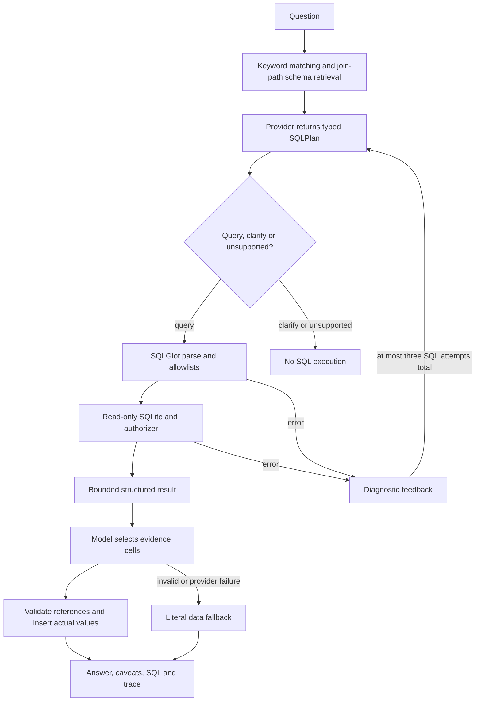

# Phase 3 — schema-aware text-to-SQL, tested offline

Phase 3 implements an inspectable planning/validation/execution/explanation pipeline. At the user's request **all verification is offline**, with scripted model responses and real SQLite execution. No model API calls were made; live generation quality is unmeasured. There is no multi-agent framework, RAG index, Python analytics tool or UI in this phase.

## Run the offline demos

Install the pinned project dependencies into the local virtual environment:

```powershell
python -m venv .venv
.venv/Scripts/python.exe -m pip install -r requirements.txt
.venv/Scripts/python.exe scripts/ask.py --demo count --json
.venv/Scripts/python.exe scripts/ask.py --demo cancellation --json
.venv/Scripts/python.exe -m unittest discover -s tests -v
.venv/Scripts/python.exe scripts/verify_text_to_sql.py
```

The demos replay two **fixed** responses and query the real database. They do not accept arbitrary natural-language questions or pretend to be a local LLM. The count demo returns 99,441 orders from this snapshot. `--json` exposes generated/replayed SQL, selected schema and retrieval reasons, actual tables referenced, result rows, execution timing, attempt trace, provider identity, truncation and available usage information.

The [offline integration report](generated/text_to_sql_report.md) replays all 11 verified Phase 2 queries through the Phase 3 pipeline. It compares every output against frozen ground truth and checks the database hash before/after. This tests compatibility and safety plumbing, not LLM execution accuracy or semantic generalization. The separate development-set schema check asks whether each question's required tables are retrieved; it does not prove retrieval for unseen paraphrases.

## Workflow



The loop belongs in `app/text_to_sql/pipeline.py`; it is ordinary Python control flow. Planning gets only the retrieved schema plus the existing static metric contract and question. Phase 2 reference SQL/answers are **not** included in live prompts. The offline integration replay supplies reference SQL explicitly through its fake provider.

## Schema awareness

`schema.py` tokenizes the question and matches a visible keyword dictionary. It adds the order grain and shortest join paths through the known data model, then reads only selected table columns/PK/FK metadata from the actual database. Every inclusion has a reason in the trace.

“Which sellers have the worst ratings?” retrieves `sellers`, `order_items`, `orders`, `reviews`, omitting payments and geolocation. A question requiring a known table missed initially can trigger **one** targeted schema expansion within the same three-attempt budget. Unknown/system tables are never added. This is an explainable baseline, not embedding retrieval or an evaluated optimal selector.

The Phase 2 shared CTE prefix names tables unnecessary for some particular queries. The replay can therefore exercise schema expansion even when initial retrieval contains every semantically required table. Both initial and final contexts are recorded rather than reporting expanded context as initial retrieval success.

## Read-only enforcement

1. SQLGlot parses the SQLite dialect; permit only one SELECT/set query, optionally with CTEs. Reject writes, command nodes, SELECT INTO, external/qualified tables, table-valued functions, unknown tables and non-allowlisted functions. Resolve table scopes to distinguish CTE aliases from physical tables.
2. Open the existing database using URI `mode=ro`, enable `query_only`, disable extension loading and trusted schema. Do not expose a write connection to the planner.
3. SQLite's authorizer independently permits only SELECT, recursive query steps, reads from validated business tables and a small built-in function allowlist. This prevents attachment, PRAGMAs, writes, extension loading and system-table reads even if a parser rule misses a construct.
4. Execute a single statement with `execute`, never `executescript`. Require unique output aliases; reject binary/nonfinite values. Limit SQL length and expression/compound-query depth, with cooperative query timeout and bounded fetched output.

Default execution limits: **3 SQL attempts**, **15 seconds per query**, **200 result rows**, **100,000 encoded row bytes**, **20,000 SQL characters**. The integration replay explicitly allows 30 seconds per query to accommodate the existing full-data reference CTEs. A SQLite progress handler checks the time budget every 1,000 VM instructions; busy waiting is also bounded. These are application limits, not an OS memory sandbox or a strict whole-request deadline. Intermediate sorting/join memory is not globally capped; a production service would isolate workers and apply external resource limits.

The output byte budget counts encoded row content, not SQL/trace metadata. SQLite also caps individual value/record size at the larger of 4,096 bytes and that budget, so a tiny preview budget can still prepare schema metadata. Over-budget results are explicitly marked truncated. A result with rows that cannot fit the preview is not presented as an empty query or zero.

SQL safety does **not** establish business correctness: a read-only query can still use the wrong population, join or denominator, and SQLite allows some semantically questionable aggregates. Reference-result evaluation remains essential. Conservative allowlists can also reject legitimate analytical SQL; expand them only with tests, not by disabling authorization.

## Retry and failure behavior

- Syntax/parser errors, missing columns, invalid aggregates and rejected SQL produce diagnostics for the next SQL attempt, including previous SQL. No infinite retry or automatic unsafe fallback exists.
- Failed generation, invalid structured output, refusal or provider failure returns an explicit failure without a numerical answer. The SDK's own automatic retries are disabled.
- A clarification/unsupported plan skips execution. Reasons from the model are not independently proven facts and remain inspectable in the trace.
- After exhaustion, there is no result. Empty results produce no invented aggregate conclusion.
- A failed explanation preserves a successfully executed result and uses literal evidence values instead of discarding the query or inventing prose.

## Grounding and its limits

The explanation model supplies a short label, zero-based row index and column name for each observation. Code verifies that the cell exists and inserts the value itself. Labels cannot contain numeric digits or obvious causal/significance wording; caveats come from a fixed dictionary. This blocks nonexistent citations and free-form numeric generation. SQL, denominators and complete returned evidence remain visible.

This mechanism does not prove that a model's label accurately describes its referenced cell, nor that the SQL answers the question. Written-out numbers or subtle misleading wording are not fully covered by simple label checks. The output is evidence-linked, not mathematically certified natural language. Broad interpretation, statistical testing and live groundedness evaluation remain later work. No causality/significance assertion is supported by this phase.

## Optional provider integration — not exercised live

`model.py` defines a small `Model` protocol: `generate(messages, output_type)`, `name`, and per-call `usage`. `OpenAIModel` uses the Responses structured-output parser with Pydantic models, following [official OpenAI structured-output documentation](https://developers.openai.com/api/docs/guides/structured-outputs). It sets `store=False`, uses a 60-second configured request timeout, caps output tokens and sanitizes provider exceptions. This preference does not assert zero provider retention under every account policy.

When live testing is explicitly desired, create local `.env` using `.env.example` and set `OPENAI_API_KEY` and `OPENAI_MODEL` to an accessible model supporting Responses structured outputs. No model name, key or price is hardcoded. Then run:

```powershell
.venv/Scripts/python.exe scripts/ask.py --live --question "Which customer states have the highest cancellation rate?" --json
```

This would transmit the question, selected schema and metric contract, plus bounded query results during explanation, to the configured provider. Offline mode never initializes that client. Provider replacement means implementing the small protocol and configuration; changing the SQLite code is unnecessary. No automatic alternative-provider or live fallback is used. Tests mock the SDK boundary; access, model compatibility, real token usage and real response quality are not verified.

## Tests and next steps

The full suite passed **53/53 tests**, including existing ingestion/baseline tests and 28 Phase 3 test methods. Tests cover all forbidden mutation keywords, CTE scope/shadowing, system-table/extension attempts, safe comments/string literals, valid SELECTs, schema retrieval, independent authorization, SQL repairs, retry exhaustion, provider failure, invalid evidence, empty/truncated output and resource limits. Some methods exercise multiple adversarial cases; the method count is not a count of distinct attacks.

Phase 4 is business-definition retrieval using embeddings/vector search. The current whole metric document is static prompt context and should not be counted as RAG. A real model evaluation and controlled comparisons are still pending; the user's current offline-only choice is preserved.
